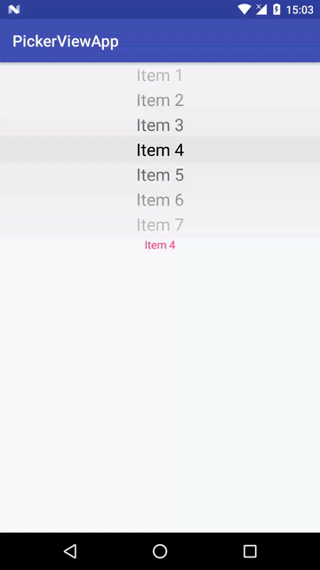
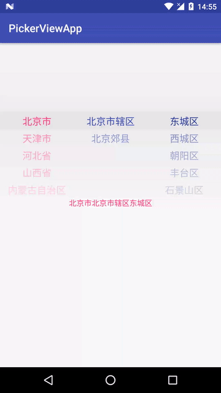
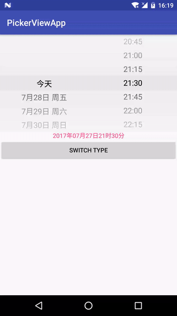
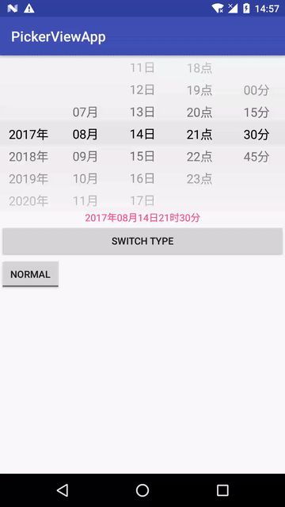
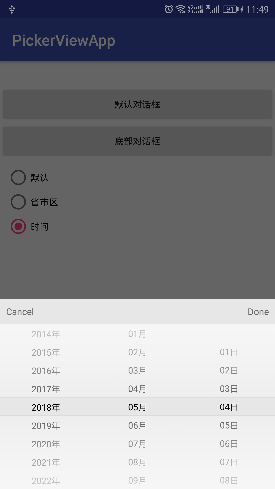
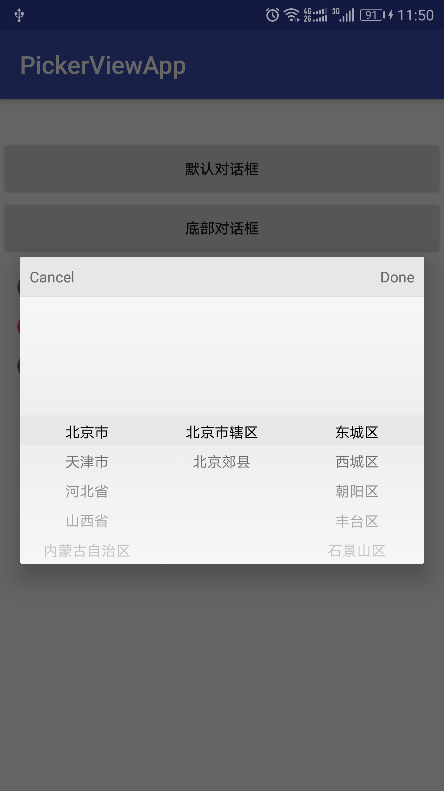

# PickerView
Android滚动选择器

 
 
 

## 使用方法

### 1. 添加依赖

> 注：${latestVersion}请替换为当前最新版本号，见[releases](https://github.com/duanhong169/PickerView/releases)。

gradle：
	
```groovy
implementation 'com.github.duanhong169:picker-view:${latestVersion}'
```

maven：
	
```xml
<dependency>
	<groupId>com.github.duanhong169</groupId>
	<artifactId>picker-view</artifactId>
	<version>${latestVersion}</version>
	<type>pom</type>
</dependency>
```

### 2. 集成到项目中

#### 2.1 集成PickerView

添加到layout文件中：

```xml
<top.defaults.view.PickerView
	android:id="@+id/pickerView"
	android:layout_width="match_parent"
	android:layout_height="wrap_content"/>
```

##### 使用列表作为数据源

```java
List<Item> items = new ArrayList<>();
for (int i = 0; i < 42; i++) {
    items.add(new Item("Item " + i));
}

pickerView.setItems(Item.sampleItems(), item -> textView.setText(item.getText()));
```

##### 实现Adapter作为数据源

配置数据源：

```java
PickerView.Adapter adapter = new PickerView.Adapter() {

    @Override
    public int getItemCount() {
        return 42;
    }

    @Override
    public String getText(int index) {
        return "Item " + index;
    }
};
pickerView.setAdapter(adapter);
```

监听选择事件：

```java
pickerView.setOnSelectedItemChangedListener((pickerView, previousPosition, selectedItemPosition) -> 
        textView.setText(pickerView.getAdapter().getText(selectedItemPosition)));
```

#### 2.2 集成DivisionPickerView

添加到layout文件中：

```xml
<top.defaults.view.DivisionPickerView
    android:id="@+id/divisionPicker"
    android:layout_width="match_parent"
    android:layout_height="wrap_content"
    app:preferredMaxOffsetItemCount="4"
    android:background="#e7e7e7"/>
```

构建省市区数据源：

> 参考[Divisions.java](app/src/main/java/top/defaults/pickerviewapp/Divisions.java)

设置数据源并监听选择事件

```java
final List<DivisionModel> divisions = Divisions.get(this);
divisionPicker.setDivisions(divisions);
divisionPicker.setOnSelectedDateChangedListener(division -> textView.setText(Division.Helper.getCanonicalName(division)));
```

#### 2.3 集成DateTimePickerView

添加到layout文件中：

```xml
<top.defaults.view.DateTimePickerView
    android:id="@+id/datePickerView"
    android:layout_width="match_parent"
    android:layout_height="wrap_content"
    app:preferredMaxOffsetItemCount="3"
    app:textSize="18sp"
    app:type="dateTime"
    app:minutesInterval="fifteen"
    app:curved="true"
    android:background="#e7e7e7"/>
```

设置初始日期：

```java
dateTimePickerView.setStartDate(Calendar.getInstance());
// 注意：月份是从0开始计数的
dateTimePickerView.setSelectedDate(new GregorianCalendar(2017, 6, 27, 21, 30));
```

监听选择事件：

```java
dateTimePickerView.setOnSelectedDateChangedListener(new DateTimePickerView.OnSelectedDateChangedListener() {
    @Override
    public void onSelectedDateChanged(Calendar date) {
        int year = date.get(Calendar.YEAR);
        int month = date.get(Calendar.MONTH);
        int dayOfMonth = date.get(Calendar.DAY_OF_MONTH);
        int hour = date.get(Calendar.HOUR_OF_DAY);
        int minute = date.get(Calendar.MINUTE);
        String dateString = String.format(Locale.getDefault(), "%d年%02d月%02d日%02d时%02d分", year, month + 1, dayOfMonth, hour, minute);
        textView.setText(dateString);
        Log.d(TAG, "new date: " + dateString);
    }
});
```

更详细的使用方法请参见示例。

### License
请查看[LICENSE](./LICENSE)文件。